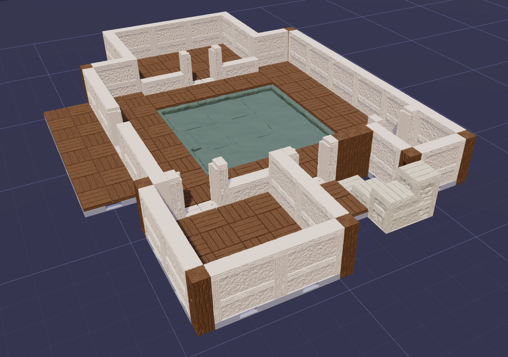

# OpenForge Layout Tool

A browser-based 3D layout tool for arranging OpenForge STL models, saving layouts, and exporting them for sharing.

## Features

- Browse the OpenForge model catalog and place STL models in a 3D viewport.
- Select multiple models by holding **Shift** while dragging a selection box.
- Move selected models with the **Arrow** keys. Hold **Shift** while moving for finer movement increments. Use **Page Up** and **Page Down** to move them vertically when needed.
- Rotate models with **R**, **X** and **Z**
- Copy and paste selections with **Ctrl+C** and **Ctrl+V**.
- Undo and redo changes with **Ctrl+Z** and **Ctrl+Y**.
- Rotate a group around its shared center point rather than rotating each model independently.
- Hold **Shift** while rotating for finer rotation increments.
- Use the standard 3D viewport controls to orbit, pan, and zoom around the layout.
- Save Templates for small reusable templates for local use.
- Save Layouts for sharing builds or saving progress.

Page Up and Page Down are primarily a workaround for occasional snapping issues, particularly when working on multi-level builds. In most layouts, models should snap into the correct vertical position automatically.

## Recommended setup: Docker

Docker is the recommended way to run the project because it provides the expected Node.js runtime and keeps the development environment consistent.

### Requirements

- Docker with Compose support
- Git
- A browser with WebGL support
- Network access to the configured OpenForge catalog endpoints when browsing or downloading catalog models

### Start the application

Clone the repo and from the project directory, run:

```sh
docker compose up --build
```

Open [http://localhost:5173](http://localhost:5173) in a browser.

The Compose configuration mounts the source files for development and keeps downloaded STL files in the project’s `downloaded/` directory. Stop the application with:

```sh
docker compose down
```

## Examples

The repository includes several example layouts in the [`layouts/`](layouts/) folder. To try one, start the application, choose **File → Load Layout**, and select one of the JSON files:

- [`Dungeon.json`](layouts/Dungeon.json) — a simple stone dungeon layout with rooms, and a central chamber.
- [`Warehouse.json`](layouts/Warehouse.json) — a large open layout using Towne set.
- [`Towne House.json`](layouts/Towne%20House.json) — a Townehouse.
- [`openforge-tutorials-1.json`](layouts/openforge-tutorials-1.json) — Replication of the first community creation here https://masterworktools.github.io/openforge-tutorials/.

The layouts will download any models they need the first time they are imported, so the initial load can take a little longer.

### Dungeon


### Towne House


### OpenForge tutorial



## Configure catalog endpoints

Compose uses these defaults:

- Catalog API: `https://staging.openforge.tools`
- Catalog objects: `https://objects.openforge.tools`

Override them with environment variables when starting Compose:

```sh
OPENFORGE_CATALOG_API_URL=https://catalog.example.com \\
OPENFORGE_CATALOG_OBJECTS_URL=https://objects.example.com \\
docker compose up --build
```

You can also put the variables in a `.env` file beside `docker-compose.yml`; Compose automatically reads that file:

```dotenv
OPENFORGE_CATALOG_API_URL=https://staging.openforge.tools
OPENFORGE_CATALOG_OBJECTS_URL=https://objects.openforge.tools
```

## Using the application

1. Start the application using Docker or the local Node.js setup.
2. Use the model palette to browse and select catalog models.
3. Choose **Place** and click in the viewport to add models.
4. Use the file tabs to work with multiple layouts.
5. Use **File → Save Layout** to export a layout as JSON.
6. Use **File → Load Layout** to restore an exported layout.
7. Use **Templates** to place built-in templates or save the current selection.

Downloaded models and layout metadata are cached locally. The `downloaded/` directory may contain STL files, thumbnails, and the metadata database after the application has been used.

## Project configuration

- `docker-compose.yml` defines the recommended development container and catalog endpoint overrides.
- `Dockerfile` builds the Node.js development image.
- `vite.config.js` provides the development server, catalog proxy, and downloaded-model storage endpoints.
- `src/` contains the browser application.
- `server/` contains server-side path and cache helpers.
- `downloaded/` is runtime storage and should remain writable when running the application.

The development server includes request validation, path traversal protection, request-size limits, and same-origin checks for state-changing local cache operations. It is intended for development and trusted local-network use.
